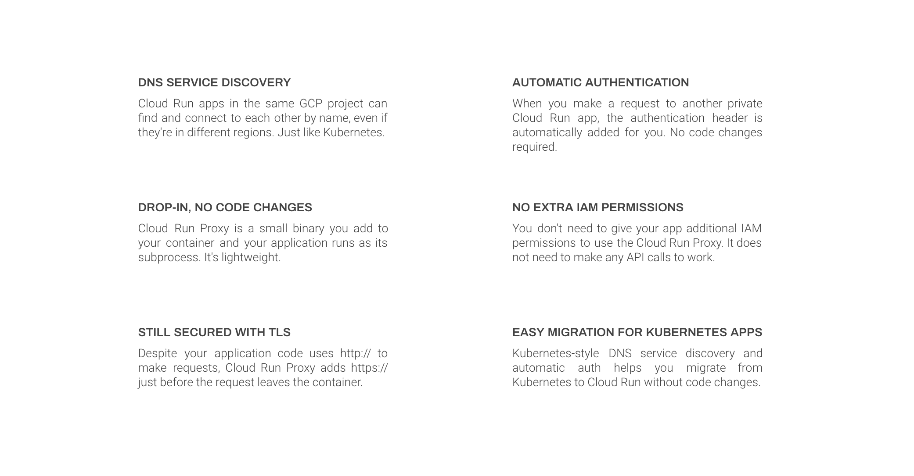

Cloud Run Proxy is a drop-in binary to your container image that runs on
[Cloud Run (fully managed)](https://cloud.run) that allows your services to
discover each other and authenticate automatically without needing to change
your code. It helps bringing existing microservices, for example from Kubernetes,
to Cloud Run.

> **NOTE:** This project is not an officially supported component of Cloud Run
> product. It's provided as-is to be a supplementary utility.

## Sign up to be an alpha user

If you’re a Google Cloud Run user, [fill out this form](#) to receive
installation instructions. We are actively trying to collect feedback and use
cases to shape this as a potential feature officially.

## Features

Cloud Run Proxy does its job in your container, entirely in userspace and does
not need to run with any additional privileges or permissions.

## DNS Service Discovery

With Cloud Run Proxy, other Cloud Run services in the same GCP project can be
resolved as `http://SERVICE_NAME[.REGION[.cloudrun.internal]]`.

## Automatic Service Authentication

To develop Cloud Run services that make requests to each other (for
example, microservices), you need to fetch an identity token from the metadata
service and set it as a header on the outbound request.

With Cloud Run Proxy, this is handled for you out-of-the-box, so you don't need
to change your code when you bring your services to Cloud Run (from other
platforms like Kubernetes).

